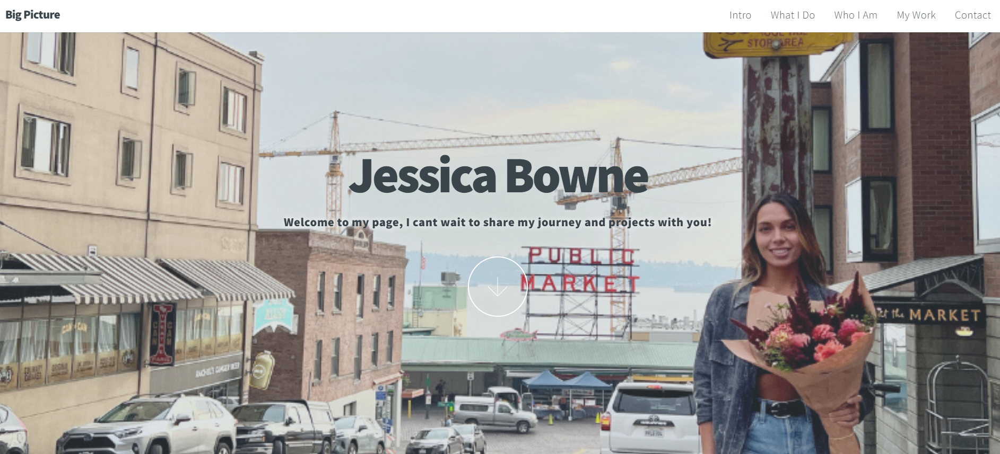

# 
My Awesome Project
The portfolio talks about my background as a software engineer and the finance industry. Towards the end you will find projects that i have worked on. 

Link to project: https://jessica-bowne-portfolio.netlify.app/

alt tag

How It's Made:
Tech used: HTML, CSS, JavaScript, 

I used HTML to update the information about myself and the sections where i added my porjects. CSS to design the layout

Optimizations

Lessons Learned:

learning how to size pictures correctly to better manage floats, figuring out my full layout before jumping into the project so I dont have to keep making major changes 